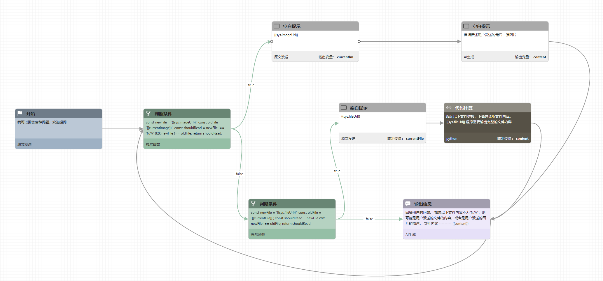

# deepseek-r1-chatbot
使用Deepseek-r1回答的聊天机器人，支持图片、文件. 流程控制使用qwen-max 2.5, 图片识别使用qwen-vl-plus.

#### 煎蛋流程

#### 使用说明

1. 创建任意煎蛋智能体
2. 点击进入智能体编辑界面
3. 点击源代码 -> 导入
4. 选择文件agent.gen，完整流程即可导入。
5. 点击设置，多模态选项里勾上 "文件"
6. 智能体的大模型选为 "qwen-max"（输出节点的模型单独选为"deepseek-r1"，图片识别节点的模型单独选为"qwen-vl-plus")
7. 保存设置
8. 点击编辑流程，点击调试按钮，即可进行问答

#### 注册煎蛋账号

1.  访问https://gendial.cn
2.  与右下角的煎蛋对话获取测试账号
